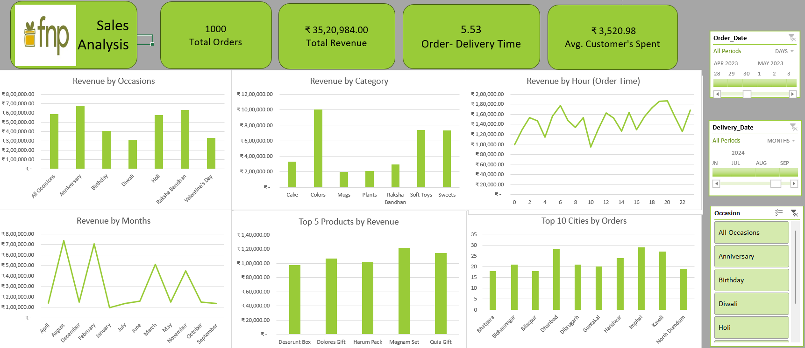

# FNP Sales Analysis Dashboard

## Overview

This Excel-based dashboard analyzes 1,000 customer orders for Ferns N Petals (FNP), providing insights into revenue, product performance, order patterns, and customer behavior.

---

## Key Highlights

- Total Revenue: ₹35,20,984  
- Average Order Value: ₹3,520  
- Avg. Delivery Time: 5.53 days  
- Top Occasions: Anniversary, Raksha Bandhan  
- Peak Sales Months: August, December, February

---

## Tools & Techniques

- Microsoft Excel  
- Power Pivot (Data Model & DAX)  
- Power Query (ETL: data transformation)  
- Pivot Tables & Charts  
- Slicers for interactivity

---

## Objective

To build a clean and interactive sales dashboard that enables quick decision-making based on trends in product categories, customer locations, and sales timing.

---

## Author

**Harshit Sagar**  
(https://www.linkedin.com/in/harshitsagar777/)

---

## Disclaimer

This project is for learning and portfolio purposes only. All brand names and data references are illustrative.
